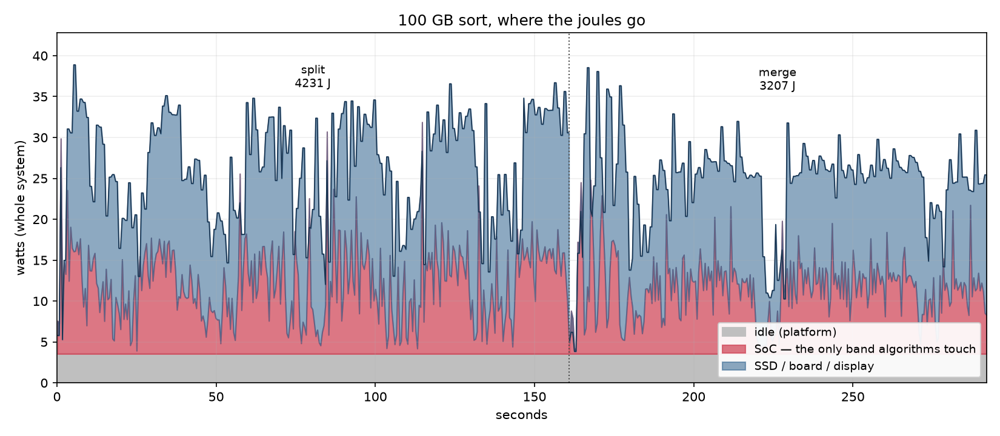

# energy-efficiency-sort

An external merge sort measured in **joules per record** rather than seconds.

Forked from [mergesort](https://github.com/shrivasshankar/mergesort), which chased
wall clock and got 500,000,000 records (47 GB) to 48.5s on a MacBook Pro — 5.9×
faster than GNU `sort` using 5.0× less CPU. That work is in
[docs/PERFORMANCE.md](docs/PERFORMANCE.md). **The sort code here is unchanged so
far**; everything below is measurement.

## Results

gensort ASCII records, `valsort`-verified. Every figure is three cold purged
runs, with power measured **during** the run rather than reconstructed from a
separate looped one. Spread is the run-to-run standard deviation.

| 47 GB, 5×10⁸ records | time | power | energy |
|---|---|---|---|
| split | 19.6s | 22.40 W | 439 J ± 5 (1.2%) |
| merge | 21.9s | 18.77 W | 412 J ± 15 (3.7%) |
| **total** | **41.5s** | | **851 J** |

**587,752 records/joule.** Conditions: unplugged, apps closed, idle 2.84 W,
disk 50% full, M3 Max (10P + 4E), 1 TB internal.

### These supersede the earlier figures, which were 42% pessimistic

| | as published before | measured directly |
|---|---|---|
| 47 GB total | 1,205 J | **851 J** |
| records/joule | 414,911 | **587,752** |

Two errors compounded.

**Power was measured in the wrong regime.** Energy used to be `looped power ×
cold time`. Looping was adopted to collect more power samples, but each
iteration inherits the previous one's writeback, so it measures a contended
machine and reports 20–44% more power than the cold run it then multiplies.
The assumption that both regimes draw the same watts was never tested. It does
not hold.

**The power tail was discarded.** `sys_power` reports a load change about 2s
late, so ending the window at the command's exit drops the end of its own
power curve. Recovering it raised split by 17% and merge by 4% — split is
worse because 50 GB of run-file writeback is still draining when the process
exits, and that energy belongs to the run.

Three cold runs cost half the disk writes of a 120s loop, produce error bars,
and need no assumption about regime equivalence. Run-to-run spread is 1.2% on
split, so changes of a few percent are now resolvable.

### The 100 GB row is withdrawn

The previous 100 GB figure (2,842 J, 351,911 records/joule) was taken with the
superseded method and is not comparable to the number above. Re-measure it
with the same protocol before drawing any conclusion from the pair.

### Scaling: superseded, kept for the reasoning

**This section rests on the two withdrawn rows and no longer stands.** Both
came from the looped-power method and only the 47 GB one has been redone. The
mechanism arguments below — that fullness is a controllable variable, and that
the merge scaled linearly while the split did not — are still worth reading.
The arithmetic is not.

Doubling the data cost **15% of records/joule** (414,911 → 351,911). Extrapolated
naively, 100 GB gives 28.4 kJ per 10¹⁰ records, or ~31.3 kJ once a ~10% charger
loss is added for a wall-side figure. But if the 15%-per-doubling trend continues
across the 3.32 doublings from 100 GB to 1 TB:

```
203,630 records/joule  ->  49.1 kJ  ->  54.0 kJ wall-equivalent
```

So the honest range for a 1 TB projection is **31 kJ if the degradation stops,
54 kJ if it continues** — and two points cannot distinguish those. A 200 GB run
would give the third point.

Two reasons to think part of that 15% is recoverable:

**Disk utilisation moved between the runs** — 50–60% for 47 GB, 55–66% for
100 GB. Fullness is separately measured as worth **2×** on merge throughput
between ~50% and 75%, so some of the loss is a controllable variable rather than
inherent scaling.

**The merge scaled linearly; the split did not.**

```
split   x2.60 wall time for x2.0 data     but x1.99 user time
merge   x2.12 wall time for x2.0 data
```

The merge going linear is the good news — 200-way fan-in instead of 100-way cost
nothing, and that was the part of the design most likely to break at scale. The
split's extra time is all I/O, since its CPU time scaled exactly 2.0×.

Throughput fell from 4.14 to 3.57 GB/s across the same two runs.

## Efficiency cores: still unanswered

The M3 Max is 10 performance + 4 efficiency cores, and the sort's 8–10 threads
all land on P-cores. Since the workload is I/O-bound at 3.57 GB/s against a
device that does roughly 4, E-cores are the obvious candidate for the one thing
that can win here: lower power at constant time.

Two attempts, both invalid:

| | split | merge | SoC power | full sort |
|---|---|---|---|---|
| baseline | 19.6s | 21.9s | 7.2 W | 851 J |
| `taskpolicy -b` | 87.3s | 95.0s | 0.46 W | 1,083 J |
| `taskpolicy -c background -d default` | 88.7s | 93.6s | 0.46 W | 1,122 J |

Both are ~4.5× slower, and the agreement between them is the finding rather
than the slowdown itself. A QoS probe shows `-b` calls
`setpriority(PRIO_DARWIN_BG)` and never sets a QoS clamp at all, so it does not
move anything onto an E-core; `-c background` does. Two unrelated mechanisms
landing within 1.6% of each other means the cause is common to both, and
therefore is not core placement.

It is disk throttling, and 0.46 W of SoC power confirms it — four saturated
E-cores would draw several times that, so the CPU is asleep waiting on I/O.
Idle draw is 46% of the run.

`-d default` failed to lift it because it sets `IOPOL_SCOPE_PROCESS`, while
background QoS throttles at `IOPOL_SCOPE_DARWIN_BG` — a different scope, which
is what `-g` controls. **The clean test is `-c utility`**, which still prefers
E-cores but sits above the QoS threshold where Darwin throttles I/O. Not yet
run.

## Where the joules actually go



Measured over the 100 GB looped runs (292s total, 3 split + 2 merge iterations),
so read the **shares**, not the absolute joules:

| band | share | what it is |
|---|---|---|
| idle | 13.9% | platform draw at 3.54 W, present whether or not you sort |
| SoC | 33.0% | CPU + GPU + ANE + RAM — the only band an algorithm touches |
| rest | 53.1% | SSD, regulators, board, display backlight |

**Two thirds of the energy is not computation.** A change that halved SoC work
would cut at most 16% of the total — and the parent repo already measured a 25%
reduction in comparison cost producing *zero* wall-clock gain, so it would not
even reach that.

The power distribution says the same thing from the other side. There are no
large idle gaps to reclaim:

```
split   6% of samples under 15 W,  40.9% in 30-50 W
merge   8% of samples under 15 W,  73.5% in 20-30 W
```

### So the levers are not algorithmic

1. **Core type, untested.** The only lever that changes power at constant time.
   Two attempts so far measured the I/O throttle instead — see above.
2. **Thread count, untested.** Distinct from core type: `merge_program 4` gives
   four threads that macOS remains free to place on P-cores.
3. **Display off, worth ~14%.** Server-class comparisons carry no display at all.
4. **Wall time**, which shrinks all three bands, but the sort is already at
   3.57 GB/s against a device that does roughly 4.
5. **I/O volume** is 4× the data for a two-pass external sort — less fixed than
   it looks. gensort ASCII records are 10 random key bytes followed by ~88 bytes
   of low-entropy filler, and compress **2.63× with lz4, 3.56× with zstd -1**.
   Compressing the run files, two of the four data movements, would cut total
   bytes moved to roughly 2.6× against an SSD that sits inside the 53% band.
   Measured on the data; untested in the sort. Note it would shift the workload
   toward CPU-bound, which changes what a cross-platform comparison compares.

## Measuring energy on Apple Silicon

`powermetrics` reports SoC package power only. Per the table above that is 33% of
the total under load and 3–6% at idle, so it cannot produce a total-system
figure.

`macmon` can, sudolessly at 1 Hz, by reading IOReport directly:

```bash
brew install macmon

./power_log.py --idle 60          # establish the baseline first
for i in 1 2 3; do
    rm -f run*.dat(N); sync && sleep 120 && sudo purge
    ./power_log.py --records 5e8 --idle-watts 2.84 --csv merge-$i.csv -- ./merge_program 10
done
```

Three cold runs, not one loop. `--interval` defaults to 1000 ms because the
IOReport channel behind `sys_power` only updates at 1 Hz — polling at 500 ms
returns every second value twice, which does not bias the integral but does
halve the real sample count and would deflate any standard deviation computed
from it. `--settle` defaults to 5 s and keeps sampling past the command's exit
so the late-reported power tail lands inside the window, netting out idle draw
across the extra seconds.

`sys_power` is the whole-system channel; `all_power` is the SoC subset. Cross-check:
in matched machine states `sys_power` agrees with the battery gauge within ~10%
(9.23 vs ~8.4 W, and 3.54 vs 3.74 W).

**It is still DC-side.** Charger conversion loss is excluded by construction, so
a wall meter should read ~10% higher. Anything published needs the wall reading.

### The battery gauge does not work for this. Four attempts:

| approach | result |
|---|---|
| integrate `InstantAmperage` | refreshes every **19.43s** (2,948 polls, 1 change in 40s). One 28s run gave 2 distinct values across 168 samples |
| `AppleRawCurrentCapacity` delta | went **up 17 mAh over 100s while discharging**. It is a state-of-charge estimate with model corrections, not a coulomb ledger |
| `AccumulatedBatteryPower` | did not change at all in 60s; update interval unknown |
| average the slow readings over 4 min | produced a 0.70 W sample during an active merge, sd 9.31 on a mean of 17.25 |

The gauge exists to say "3:58 remaining" — smooth and stable by design, which is
the opposite of what a 30-second measurement needs. `FilteredCurrent` sits beside
`InstantAmperage` in the same ioreg dump.

## Conditions that changed measurements here

Every one of these silently corrupted at least one run today. Record all three:

```
power source     idle 7.97 W plugged  vs  3.54 W unplugged
open apps        11.61 W  ->  8.39 W  ->  3.74 W as they were closed
disk fullness    merge 45.6s at ~75% full  vs  24.4s at ~50%   (2x)
```

The protocol that makes runs comparable, inherited from the parent repo:

```bash
rm -f run*.dat output.dat && sync && sleep 120 && sudo purge
```

`purge` drops clean pages but cannot drop dirty ones, so benchmarking shortly
after writing tens of GB means competing with your own writeback.

## Open

In priority order:

- **`taskpolicy -c utility`.** The E-core test that has not actually been run
  yet. Everything above about core type is blocked behind it.
- **The Linux side.** The point of this fork is Apple Silicon versus x86 as a
  platform, and there is no x86 figure here measured the same way. Decide the
  basis before measuring: 53% of the energy is SSD, board and display, so a
  whole-system comparison is largely chassis. SoC-vs-RAPL and
  wall-meter-vs-wall-meter answer different questions.
- **Re-measure 100 GB** with the three-cold-run protocol, so the scaling
  question has two comparable points again.
- **A wall meter** for an AC-side figure. Everything here is DC-side and ~10%
  optimistic by construction.
- **A thread-count sweep for joules**, not seconds. Still untested.
